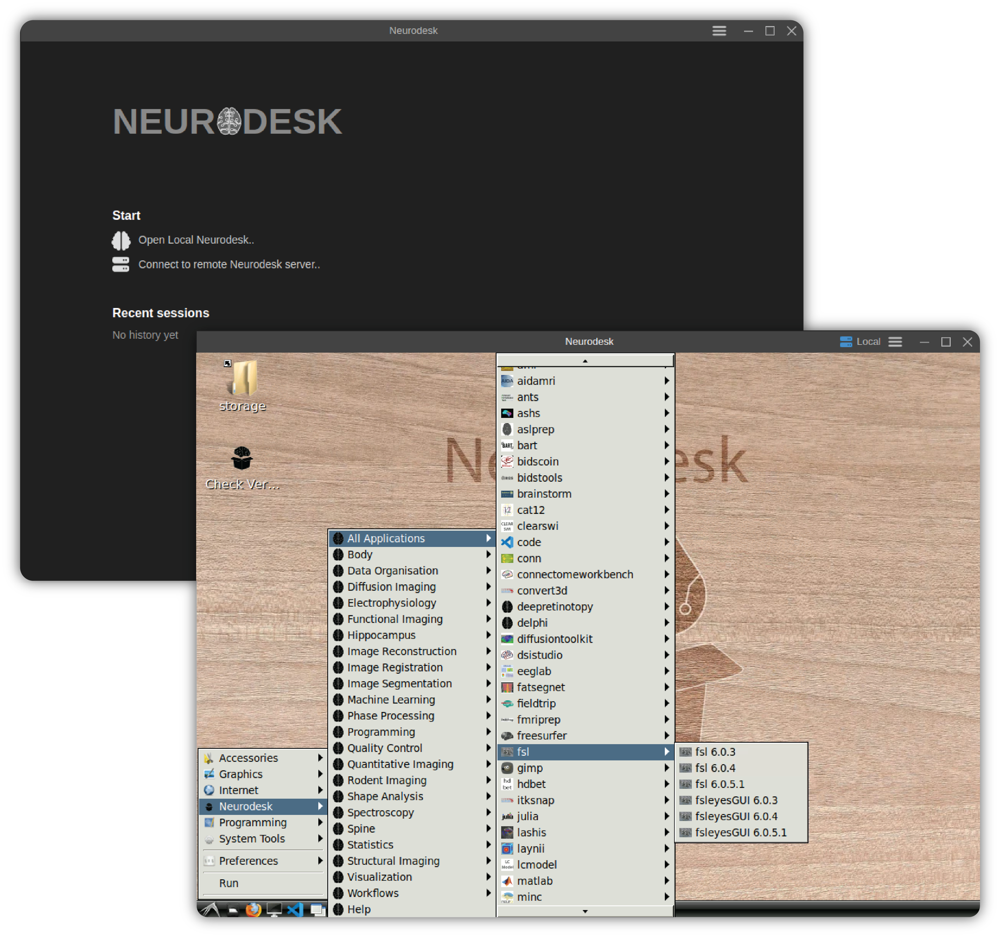

# Neurodesk App

<!-- STATS_START -->

<!-- STATS_END -->

Neurodesk App is the cross-platform desktop application for [Neurodesk](https://github.com/neurodesk/neurodesk-app). It is the quickest and easiest way to get started with Neurodesk on your personal computer, with the flexibility for advanced use cases.

## Installing Docker

Neurodesk App requires Docker to be installed on your computer. If you already have Docker installed, you can skip this step.

- [Docker Desktop for Windows](https://docs.docker.com/docker-for-windows/install/)
- [Docker Desktop for Mac](https://docs.docker.com/docker-for-mac/install/)
- [Docker Engine for Linux](https://docs.docker.com/engine/install/)

After installation, open a terminal (Linux/macOS) or command prompt (Windows) and run the following command to verify that Docker is working correctly:
`docker --version`

## Installing Neurodesk App

If you have an existing Neurodesk App installation, please uninstall it first by following the [uninstall instructions](user-guide.md#uninstalling-neurodesk-app).

- [Debian, Ubuntu Linux Installer](https://github.com/NeuroDesk/neurodesk-app/releases/latest/download/NeurodeskApp-Setup-Debian.deb)
- [Red Hat, Fedora, SUSE Linux Installer](https://github.com/NeuroDesk/neurodesk-app/releases/latest/download/NeurodeskApp-Setup-Fedora.rpm)
- [Arch-based package via AUR](https://aur.archlinux.org/packages/neurodeskapp-bin)
- [macOS Intel Installer](https://github.com/NeuroDesk/neurodesk-app/releases/latest/download/NeurodeskApp-Setup-macOS-x64.dmg), [macOS Apple silicon Installer](https://github.com/neurodesk/neurodesk-app/releases/latest/download/NeurodeskApp-Setup-macOS-arm64.dmg)
- [Windows Installer](https://github.com/NeuroDesk/neurodesk-app/releases/latest/download/NeurodeskApp-Setup-Windows.exe)

> :warning: **On Microsoft edge**, follow these steps to download the executable file:
> 

## Launching Neurodesk App

Neurodesk App can be launched from the GUI of your operating system by clicking the application's icon or by using `neurodeskapp` command from the command line.

Neurodesk App sets File Browser's root directory based on the launch method.

- If launched from the application icon on GUI or by using `neurodeskapp` command without any arguments, then the default working directory is set as the root directory. The default working directory is user home directory but it can be customized from the Settings dialog.

- If `neurodeskapp` command is used with a directory path as the argument or with the `--working-dir` argument the directory in the argument is set as the root directory.

## Sessions and Projects

Sessions represent local project launches and connections to existing Neurodesk servers. Each Neurodesk UI window in the app is associated with a separate session and sessions can be restored with the same configuration later on.

Each launch of Neurodesk in a different working directory is a separate project and projects can have their own configuration such as Python environment and UI layout.

### Session start options

You can start a new session by using the links at the Start section of the Welcome Page.

- `Open Local Neurodesk..` creates a new session in the default working directory.
- `Connect...` creates a session by connecting to a remote Neurodesk server.

Previously opened sessions are stored as part of application data and they are listed on Welcome Page. Clicking an item in the `Recent sessions` list restores the selected session.

### Add Custom Data Directory

Neurodesk App stores its data in the following locations:

- By default, /home/jovyan/neurodesktop-storage in the app (which is binded with local directory ~/neurodesktop-storage in Unix or C:/neurodesktop-storage in Windows)

- By choice, in the setting window below, select `Additional Directory` on the left side bar, click `Change` button to select the local directory, then click `Apply & restart`. The next time you start the app, the data from the local directory can be found in /home/jovyan/data.

### See [user guide](user-guide.md) for configuration options

### See [troubleshooting guide](troubleshoot.md) for troubleshooting issues

### For contributing, see [developer documentation](dev.md)
